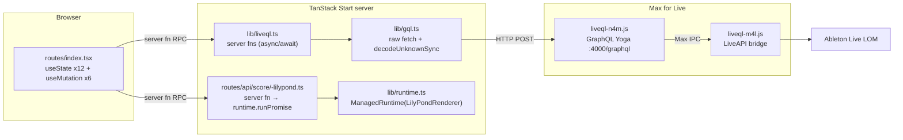
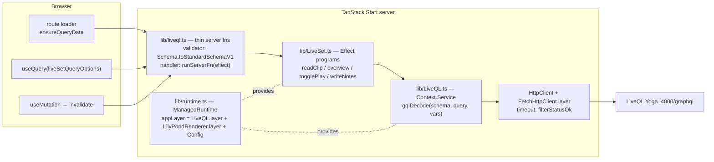
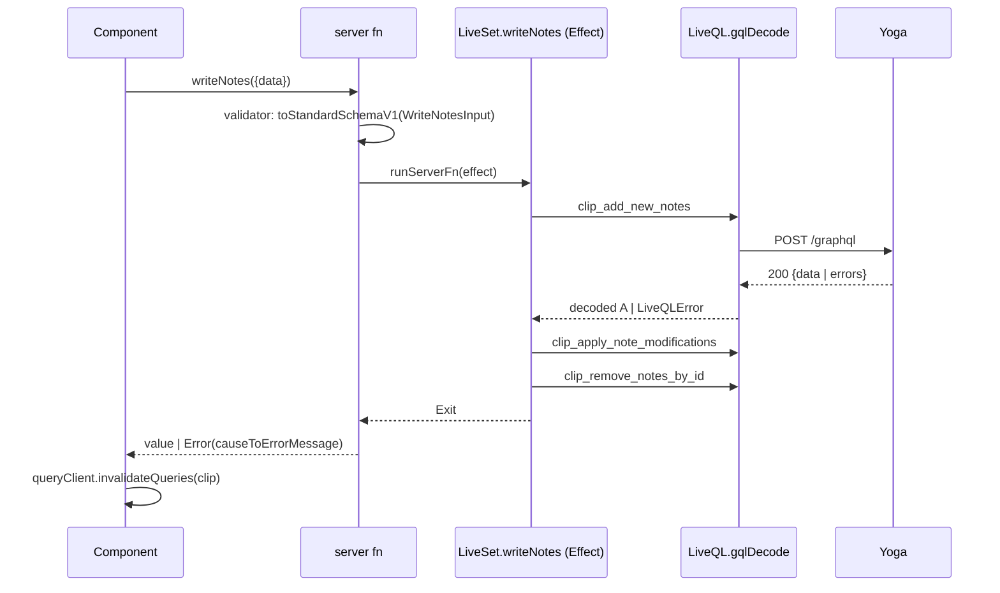

# Architecture + Effect v4 Research

Date: 2026-08-31

Goal: nail down prelive's architecture and a plan to make it idiomatic Effect v4. Grounded in three sources: this repo's `src/`, `refs/bang` (Shopify app, `effect@4.0.0-rc.108`, mature Effect patterns), and `refs/effect` (the Effect v4 monorepo at rc.112 — same version as this project's `package.json`).

Scope decision (confirmed): Effect stays **server-side only**. React components remain plain TanStack Query/Form consumers. Server functions are the boundary.

---

## 1. Current architecture



Two parallel worlds on the server:

- **Effect world**: `lib/runtime.ts` (ManagedRuntime + ConfigProvider), `lib/lilypond/renderer.ts` (`Context.Service` with `layerNoDeps`/`layer`, `Effect.fn`, `Schema.TaggedError`, scoped temp dirs). This is already idiomatic v4.
- **Promise world**: everything LiveQL. `lib/gql.ts` + `lib/liveql.ts` never touch the runtime.

LiveQL contract (from `refs/liveql`, see `docs/liveql-lom-graphql-research.md`):

- Yoga 5.22 on `http://localhost:4000/graphql`, plain HTTP POST, no auth, no subscriptions — clients poll.
- SDL lives as a `typeDefs` template literal in `refs/liveql/liveql-n4m.js` (~lines 90–230). No `.graphql` artifact. **Introspection is on** (GraphiQL works), so schema is exportable via a standard introspection query while Live is running.
- Two-phase addressing: query by index to get a runtime `id`, mutate by `id`. Ids are **not stable across Live sessions** — never cache them across restarts.
- Errors arrive unmasked with **HTTP 200**: `{"errors":[{"message":"..."}],"data":{...}}`.
- The characteristic failure mode is **connection refused** (Live not running, device not started, `script start` not clicked) — not a GraphQL error.

## 2. Gap analysis

### 2.1 `lib/gql.ts` — the whole problem in 25 lines

```ts
export async function gql<T>(query, dataSchema, variables?): Promise<T> {
  const response = await fetch(ENDPOINT, {...});
  const json = (await response.json()) as GqlResponse;
  if (json.errors?.length) {
    throw new Error(json.errors.map((e) => e.message).join("; "));
  }
  return Schema.decodeUnknownSync(dataSchema)(json.data);
}
```

- Raw `fetch`, not `HttpClient` — no service boundary, untestable without a live Yoga server, no timeout, no status filtering (`response.json()` on a 500 throws an opaque SyntaxError).
- `as GqlResponse` — an unchecked assertion at the exact boundary the project's own philosophy says to validate.
- Three distinct failures (transport, GraphQL errors, decode) collapse into untyped `throw` — connection-refused (the common case) surfaces as `fetch failed` with no guidance.
- `Schema.decodeUnknownSync` throws a defect instead of failing typed. Effect docs: use `decodeUnknownEffect` "when you are already inside Effect code so validation errors remain typed in the error channel" (`refs/effect/LLMS.md`).
- `ENDPOINT` hardcoded — LiveQL's port is user-configurable in the device; `runtime.ts` already wires `ConfigProvider.fromEnv` that nothing reads.

### 2.2 `lib/liveql.ts` — server fns bypass Effect entirely

- Every handler is `async`/`await` + `gql`; the ManagedRuntime sits unused one file over.
- Validators are identity functions — **no validation of client input**:

```ts
.validator((data: { trackIndex: number; slotIndex: number }) => data)
```

bang validates every server-fn input: `.validator(Schema.toStandardSchemaV1(memorySearchSchema))`.

- `togglePlay` is read-then-branch-then-mutate imperative promise code; `writeNotes` is three sequential `if` blocks of awaits with no typed error path — a mid-sequence failure leaves the clip partially written and the client gets a stringly error.
- Query field lists in the template literals duplicate `Domain.ts` field lists by hand (drift only caught at runtime decode).

### 2.3 `routes/api/score/-lilypond.ts` — redundant provide

```ts
runtime.runPromise(Effect.gen(...).pipe(Effect.provide(LilyPondRenderer.layer)))
```

`appLayer` already contains `LilyPondRenderer.layer`. v4's shared MemoMap makes this a safety net, not a bug, but the migration guide is explicit: memoization "is NOT a substitute for proper layer composition" (`refs/effect/migration/layer-memoization.md`). The provide should go.

### 2.4 `routes/index.tsx` — reads modeled as mutations

- `readClip`, `readLiveSetOverview`, `readClipBySlot` run through `useMutation`, results copied into `useState` (`setOverview`, `setBaseline`, …). No query cache, no loader, no invalidation — mutation `onSuccess` chains hand-roll what TanStack Query does natively.
- Route has no `loader`; first paint is an empty navigator until the user clicks Refresh. `router.tsx` already wires `setupRouterSsrQueryIntegration` — the infrastructure for bang's loader pattern exists unused.
- Draft-editing state (`draft`, `modifiedNoteIds`, `deletedNoteIds`, `selectedKeys`) is legitimately client state and stays as-is under the server-side-only scope decision.

### 2.5 What's already right

- `Domain.ts` base-schemas-plus-`.fields`-spread composition is sound and matches bang's field-reuse idiom (`ObservedMemory = Schema.Struct({ key: MemoryEntry.fields.key, ... })`).
- `LilyPondRenderer` is a model v4 service: `Context.Service`, `layerNoDeps` vs `layer`, `Effect.fn("Service.method")`, `Schema.TaggedError` with `cause: Schema.Defect()`, scoped resource cleanup.
- `runtime.ts` ManagedRuntime-per-process is the right shape for a single long-lived Node server (bang's per-request runtime is a Cloudflare Workers constraint, not a pattern to copy).

## 3. Reference patterns

### 3.1 bang's GraphQL service — the template

`refs/bang/src/lib/ShopifyAdmin.ts` (69 lines): a `Context.Service` exposing `graphql` (raw) and `graphqlDecode` (the only sanctioned call path). `graphqlDecode` collapses GraphQL `errors` and Schema decode failure into one `ShopifyError`:

```ts
const graphqlDecode = Effect.fn("ShopifyAdmin.graphqlDecode")(function* <A>(schema, query, options) {
  const { data, errors } = yield* graphql(query, options);
  if (errors) yield* Effect.fail(new ShopifyError({ message: ..., cause: errors }));
  return yield* Schema.decodeUnknownEffect(schema)(data).pipe(
    Effect.mapError((cause) => new ShopifyError({ message: "response validation failed", cause })));
});
```

Queries are plain `#graphql` template literals. Types come from **hand-written Effect Schemas, never codegen**. Three-tier error split: transport → `ShopifyError`; GraphQL `errors` → `ShopifyError`; per-mutation `userErrors` → domain error (`FlowError`).

The cleanest transport in bang is `refs/bang/src/lib/ShopifyPartner.ts` — `HttpClient` from `effect/unstable/http`, and it matches the canonical example in `refs/effect/ai-docs/src/50_http-client/10_basics.ts` exactly:

```ts
const client = (yield* HttpClient.HttpClient).pipe(
  HttpClient.mapRequest(flow(HttpClientRequest.acceptJson, ...)),
  HttpClient.filterStatusOk,
  HttpClient.retryTransient({ schedule: Schedule.exponential("500 millis").pipe(Schedule.jittered), times: 2 }),
);
// per call:
HttpClientRequest.post(endpoint).pipe(
  HttpClientRequest.bodyJsonUnsafe({ query, variables }),
  client.execute,
  Effect.flatMap(HttpClientResponse.schemaBodyJson(ResponseSchema)),
  Effect.mapError(partnerError("Partner API request failed")),
);
```

Layer is self-contained: `Layer.effect(...).pipe(Layer.provide(FetchHttpClient.layer))`.

### 3.2 bang's serverFn → Effect bridge

bang injects `runEffect` through Start's request context (`worker.ts` → middleware narrows it). The part portable to prelive is the **exit handling**, since the serverFn boundary strips everything except `Error.message`:

```ts
const exit = await managedRuntime.runPromiseExit(effect);
if (Exit.isSuccess(exit)) return exit.value;
throw new Error(causeToErrorMessage(exit.cause)); // Cause.prettyErrors flattened to one string
```

`causeToErrorMessage` (`refs/bang/src/lib/LayerEx.ts`) walks `error.cause` chains so `LiveQLError: ... [cause]: ParseError: ...` reaches the Banner component intact.

### 3.3 bang's loader pattern

- **Pattern A (default)**: module-private `getLoaderData` server fn per route, `loader: () => getLoaderData()`, `Route.useLoaderData()`, mutations + `router.invalidate()`. Loader contract named `<RoutePrefix>LoaderData` in Domain.
- **Pattern B (`app.live`)**: `queryOptions` colocated with the page component, `loader: ({ context: { queryClient } }) => queryClient.ensureQueryData(opts)`, component `useQuery({ ...opts, initialData })`, mutations write back via `queryClient.setQueryData` / invalidate. Global `staleTime: 30_000` prevents SSR double-fetch.

Pattern B fits prelive: one page, several independently-refreshing reads, mutation → refetch chains already hand-coded.

### 3.4 Effect v4 idioms to hold the line on

From `refs/effect/LLMS.md`, `migration/*.md`, `.patterns/effect.md` — v4 renames make most online (v3) examples wrong:

| Concern   | v4 idiom                                                                                                                                                                                                           |
| --------- | ------------------------------------------------------------------------------------------------------------------------------------------------------------------------------------------------------------------ |
| Services  | `Context.Service<Self, Shape>()("id")` — `Effect.Service`/`Context.Tag` don't exist                                                                                                                                |
| Layers    | `static readonly layer` / `layerNoDeps`; `Layer.provide` hides, `provideMerge` re-exposes                                                                                                                          |
| Errors    | `Schema.TaggedError` when crossing a boundary, `Data.TaggedError` in-process; fail via `return yield* new E({...})`                                                                                                |
| Catching  | `Effect.catch` (not `catchAll`), `catchTag(["A","B"], f)`, `catchTags({...})`; reason family for one-error-many-causes                                                                                             |
| Decode    | `Schema.decodeUnknownEffect` inside Effect code; `toStandardSchemaV1` at TanStack seams; `decodeUnknownSync` only in tests                                                                                         |
| Functions | `Effect.fn("Service.method")` — names the tracing span; never a bare function returning `Effect.gen`; trailing combinator args, not `.pipe`                                                                        |
| HTTP      | `HttpClient` from `effect/unstable/http` + `FetchHttpClient.layer`; `HttpClientResponse.schemaBodyJson(schema)`                                                                                                    |
| Match     | `Match.value(x).pipe(Match.tagsExhaustive({...}))` for consuming tagged unions; `Match.typeTags` for reusable total functions                                                                                      |
| Data      | plain objects are structurally `Equal` in v4 — `Data.struct`/`Data.array` removed; `readonly T[]` + native `Map`/`Set` is bang's house style; `Chunk`/`HashMap` only for structural keys or heavy append workloads |
| Predicate | runtime guards on values you own (`Predicate.isObject`, `hasProperty`); **untrusted input is Schema's job, not Predicate's** — bang uses `Predicate` zero times                                                    |
| Option    | tri-role: absence from storage, decode-as-classification (`decodeUnknownOption`), verified negative ("checked, none" — never "unknown")                                                                            |
| Either    | renamed `Result` in v4; typed error channel usually replaces it — bang uses it zero times                                                                                                                          |

Honest calibration: "leverage Effect more" here means **services, Layer, Schema-at-every-boundary, typed errors, Match** — not `Chunk`/`HashMap`/`Predicate` everywhere. bang at 1600-line scale uses none of the exotic collections.

## 4. Target architecture





### 4.1 `lib/LiveQL.ts` — the service

```ts
export class LiveQLError extends Schema.TaggedError<LiveQLError>()(
  "LiveQLError",
  {
    reason: Schema.Literals(["transport", "graphql", "decode"]),
    message: Schema.String,
    cause: Schema.Defect(),
  },
) {}

const GqlEnvelope = Schema.Struct({
  data: Schema.optional(Schema.Unknown),
  errors: Schema.optional(
    Schema.Array(Schema.Struct({ message: Schema.String })),
  ),
});

export class LiveQL extends Context.Service<
  LiveQL,
  {
    readonly gqlDecode: <A>(
      schema: Schema.ConstraintDecoder<A>,
      query: string,
      variables?: Record<string, unknown>,
    ) => Effect.Effect<A, LiveQLError>;
  }
>()("app/LiveQL") {
  static readonly layerNoDeps: Layer.Layer<
    LiveQL,
    never,
    HttpClient.HttpClient
  > = Layer.effect(
    LiveQL,
    Effect.gen(function* () {
      const endpoint = yield* Config.string("LIVEQL_ENDPOINT").pipe(
        Config.withDefault("http://localhost:4000/graphql"),
      );
      const client = (yield* HttpClient.HttpClient).pipe(
        HttpClient.mapRequest(HttpClientRequest.acceptJson),
        HttpClient.filterStatusOk,
      );
      const gqlDecode = Effect.fn("LiveQL.gqlDecode")(function* <A>(
        schema: Schema.ConstraintDecoder<A>,
        query: string,
        variables?: Record<string, unknown>,
      ) {
        const { data, errors } = yield* HttpClientRequest.post(endpoint).pipe(
          HttpClientRequest.bodyJsonUnsafe({ query, variables }),
          client.execute,
          Effect.flatMap(HttpClientResponse.schemaBodyJson(GqlEnvelope)),
          Effect.timeout("10 seconds"),
          Effect.mapError(
            (cause) =>
              new LiveQLError({
                reason: "transport",
                message:
                  "LiveQL unreachable — is Live running with the liveql device started?",
                cause,
              }),
          ),
        );
        if (errors !== undefined && errors.length > 0) {
          return yield* Effect.fail(
            new LiveQLError({
              reason: "graphql",
              message: errors.map((e) => e.message).join("; "),
              cause: errors,
            }),
          );
        }
        return yield* Schema.decodeUnknownEffect(schema)(data).pipe(
          Effect.mapError(
            (cause) =>
              new LiveQLError({
                reason: "decode",
                message: "LiveQL response validation failed",
                cause,
              }),
          ),
        );
      });
      return LiveQL.of({ gqlDecode });
    }),
  );

  static readonly layer = Layer.provide(
    this.layerNoDeps,
    FetchHttpClient.layer,
  );
}
```

Decisions encoded here:

- **One `LiveQLError` with a `reason` literal**, following bang's single-`ShopifyError` shape but keeping transport distinguishable so the UI can say "start the device" instead of dumping a decode diff. If reasons grow behaviors, upgrade to v4's reason family (`Effect.catchReason`, `refs/effect/ai-docs/src/01_effect/04_errors/20_reason-errors.ts`).
- `Schema.ConstraintDecoder<A>` as the schema parameter type — bang's documented choice (`FlowAction.ts:264` JSDoc): concrete so struct optionality resolves at the call site; a `Top`-bounded generic defers it and property access fails to compile.
- **No retry.** LiveQL calls cost a full HTTP → Node → Max IPC → LiveAPI round trip; connection-refused means "user hasn't started the device" and retrying can't fix it; mutations (`clip_add_new_notes`) aren't idempotent. `Effect.timeout` guards a hung Max IPC. Matches bang's deliberate no-retry on Admin GraphQL.
- Envelope decoded with Schema, killing the `as GqlResponse` assertion.
- Endpoint via `Config` with default — the device port knob finally reaches the client through `LIVEQL_ENDPOINT`.

### 4.2 `lib/LiveSet.ts` — operations as Effect programs

Move each handler body from `liveql.ts` into `Effect.fn` programs requiring `LiveQL`. Server fns become thin. Example, `togglePlay` losing its imperative branch:

```ts
export const togglePlay = Effect.fn("LiveSet.togglePlay")(function* () {
  const { gqlDecode } = yield* LiveQL;
  const { live_set } = yield* gqlDecode(
    PlayStateResponse,
    `{ live_set { id is_playing } }`,
  );
  const mutation = live_set.is_playing
    ? "song_stop_playing"
    : "song_continue_playing";
  const result = yield* gqlDecode(
    toggleResponse(mutation),
    `mutation($id: Int!) { ${mutation}(id: $id) { is_playing } }`,
    { id: live_set.id },
  );
  return result.is_playing;
});
```

`writeNotes` stays a sequence of three conditional mutations (LiveQL has no batch), but as one `Effect.gen` the partial-failure story becomes explicit and typed instead of an abandoned promise chain. Response schemas stay colocated with their queries (bang: `FlowTriggerReceiveResponse` beside the mutation string), composed from `Domain.ts` `.fields`.

### 4.3 `lib/runtime.ts` — bridge helper

```ts
const appLayer = Layer.mergeAll(
  ConfigProvider.layer(ConfigProvider.fromEnv()),
  LilyPondRenderer.layer,
  LiveQL.layer,
);
export const runtime = ManagedRuntime.make(appLayer);

export const runServerFn = async <A, E>(
  effect: Effect.Effect<A, E, Layer.Success<typeof appLayer>>,
): Promise<A> => {
  const exit = await runtime.runPromiseExit(effect);
  if (Exit.isSuccess(exit)) return exit.value;
  throw new Error(causeToErrorMessage(exit.cause));
};
```

- `Layer.Success<typeof appLayer>` as the `R` bound — no hand-maintained union (bang `worker.ts:174`).
- Port `causeToErrorMessage`/`formatErrorMessage` from `refs/bang/src/lib/LayerEx.ts` — the serverFn boundary strips everything but `Error.message`, so flatten the pretty `Cause` (tag, message, `[cause]:` chain) into it. Banner components then show `LiveQLError: LiveQL unreachable — …` for free.
- One process-lifetime runtime is correct here; bang's per-request runtime and `runEffect`-in-request-context exist for Cloudflare env/session scoping prelive doesn't have. Simplest bridge that preserves the pattern's substance.
- Delete the redundant `Effect.provide(LilyPondRenderer.layer)` in `-lilypond.ts`; its handler becomes `runServerFn(...)` too.

### 4.4 Server fns — validate the boundary

```ts
export const readClipBySlot = createServerFn({ method: "GET" })
  .validator(
    Schema.toStandardSchemaV1(
      Schema.Struct({
        trackIndex: Schema.Int.check(Schema.isGreaterThanOrEqualTo(0)),
        slotIndex: Schema.Int.check(Schema.isGreaterThanOrEqualTo(0)),
      }),
    ),
  )
  .handler(({ data }) => runServerFn(LiveSet.readClipBySlot(data)));
```

Every current identity validator gets a real schema; `WriteNotesInput` moves from an interface to a `Domain` schema (it already half-exists as `Domain.NoteInput`). This is the "validate all external data" principle applied to our own client, not just LiveQL.

### 4.5 Client — loader + queryOptions (bang Pattern B)

- `liveSetQueryOptions` / `clipQueryOptions(slot)` colocated with the page; route gets `loader: ({ context: { queryClient } }) => queryClient.ensureQueryData(liveSetQueryOptions)` so the navigator is populated on first paint (SSR-seeded via the already-wired `setupRouterSsrQueryIntegration`).
- `readClip`/`readClipBySlot`/`readLiveSetOverview` become `useQuery`; `writeNotes`/`fireClip`/`togglePlay` stay `useMutation` with `onSuccess: () => queryClient.invalidateQueries(...)` replacing the hand-rolled `readMutation.mutate()` chains; `useState` mirrors of server data (`overview`, `baseline`, `clipInfo`, `trackName`) collapse into query data.
- Draft-editing state stays local React state (out of scope by decision).
- Caveat: LiveQL ids are session-scoped — keep `staleTime` low/zero for clip queries and never persist ids; a Live restart invalidates everything (a `reason: "graphql"` id-not-found error is the signal to refetch overview).

## 5. GraphQL typing: Schema decode vs codegen

Decision: **hand-written Effect Schemas remain the source of truth for response types; codegen at most as a build-time validator.** Same conclusion bang reached (`.graphqlrc.ts` + "Run `pnpm graphql-codegen` after any change to `#graphql` template literal strings" — codegen validates literals against the SDL; zero generated types are imported).

|                       | Schema decode (chosen)                                                                           | codegen + Effect wrapper                                                                                |
| --------------------- | ------------------------------------------------------------------------------------------------ | ------------------------------------------------------------------------------------------------------- |
| Runtime validation    | Hard validation at the boundary — a LiveQL bug or schema drift fails loud with a ParseError diff | Generated types are compile-time assertions; a `Float` where `Int!` was promised sails through silently |
| Query/selection drift | Caught only at runtime decode                                                                    | Caught at build time against SDL — the real win                                                         |
| Toolchain             | none                                                                                             | graphql-codegen + SDL artifact + config; SDL only obtainable while Live is running (or vendored)        |
| Type ergonomics       | One type system (Schema) end to end; branded/refined types possible at decode                    | Two parallel type sources (generated vs Domain) that must be reconciled                                 |
| Precedent             | bang: all response types are hand-written Schemas                                                | bang uses codegen only as a validator                                                                   |

Your instinct is the documented Effect position: external data gets parsed, not asserted (`refs/effect/LLMS.md`: "use `Schema` to parse untrusted data"). Codegen's genuine value — catching query-vs-schema drift at build time — is capturable without adopting generated types:

1. **Vendor the SDL**: `scripts/liveql-schema.ts` runs the standard introspection query against `http://localhost:4000/graphql` (introspection is on; precedent: the abandoned liveql companion app's `download-schema` script, `refs/liveql/docs/m4l-liveql-notes.md:58`), prints SDL to `refs/liveql-schema.graphql`. Rerun when the device updates. Cheap fallback: copy the `typeDefs` literal out of `liveql-n4m.js`.
2. **Optional validator step**: graphql-codegen (or graphql-eslint) pointed at the vendored SDL + `#graphql`-prefixed literals in `src/**`, emitting nothing — build fails on an invalid query or a field that doesn't exist. Adopt only if query drift actually bites; with a 7-type schema and one page, manual discipline may suffice.
3. Deriving Effect Schemas _from_ SDL automatically: no maintained SDL→Effect-Schema generator exists for v4 (rc). Hand-written `Domain.ts` composed via `.fields` spreads stays; the decode step is what enforces agreement anyway.

## 6. Migration plan

Ordered so each phase lands green (`pnpm typecheck && pnpm lint`) independently:

1. **`lib/LiveQL.ts`**: service + `LiveQLError` + envelope schema, per §4.1. Add `LiveQL.layer` to `appLayer`; add `runServerFn` + ported `causeToErrorMessage` to `runtime.ts`; drop the redundant provide in `-lilypond.ts`. Delete `lib/gql.ts`.
2. **`lib/LiveSet.ts`**: move the five operation bodies out of `liveql.ts` into `Effect.fn` programs; colocate response schemas; the thin server fns land in `lib/serverFns.ts` (not `lib/liveql.ts` — macOS's case-insensitive filesystem makes that the same file as `LiveQL.ts`) with real `toStandardSchemaV1` validators.
3. **Client restructure**: queryOptions + route loader + `useQuery`/invalidation per §4.5; delete the server-data `useState` mirrors and mutation-chaining.
4. **Schema tooling**: `scripts/liveql-schema.ts` introspection dump; decide on the validator step after living with it.
5. **Later / optional**: polling for Live-side changes (LiveQL has no subscriptions — a `refetchInterval` on the overview query is the whole feature); `@effect/vitest` tests for `LiveSet` programs against a `LiveQL` test layer (`Layer.mock(LiveQL, {...})` — services make this possible at all, which is the point).

## 7. Hydration

bang's hydration machinery is three separate mechanisms (investigated 2026-08-31; first two adopted, SSR strategy decision: keep full SSR):

1. **`useHydrated()` + `inert` gating** (`refs/bang/src/routes/app.tsx:215`). The hook comes from `@tanstack/react-router` (exported beside `ClientOnly`). bang wraps app content in `<div inert={!hydrated} data-app-hydrated={hydrated ? "true" : undefined}>`: pre-hydration clicks are blocked at the DOM level instead of silently dropped, and the attribute is a DOM signal for hydration commit — Playwright's actionability is inert-blind, so e2e waits on the marker, not a sleep. The attribute is `"true" | absent` deliberately: a bare boolean would render the truthy string `"false"` pre-hydration. bang also gates browser-only APIs on `hydrated` (App Bridge `idToken()` throws server-side; socket `enabled: hydrated` skips a wasted tokenless connect). **Adopted in prelive's `__root.tsx` `RootComponent`** — the dead-click window on "Read from Live" was observed directly during browser verification of the migration. Tradeoff: the pre-hydration window becomes explicitly non-interactive rather than deceptively live; on a localhost tool the window is tiny.
2. **Router `dehydrate`/`hydrate` hooks** (`refs/bang/src/router.tsx:52`). Global SSR→client transport for a per-document value (bang: the D1 read-replica bookmark). Chosen over a loader because the hooks fire exactly once per document and are immune to `router.invalidate()`; `setupRouterSsrQueryIntegration` wraps (not replaces) them, so it must run after `createRouter`. **Not adopted** — prelive has no per-document value to ship. Future candidate: a Live-session identity marker to detect Live restarts and flush session-scoped LiveQL ids, if overview polling ever proves insufficient.
3. **QueryClient default `staleTime: 30_000`** (`refs/bang/src/router.tsx:17`). Global default so every loader-seeded query survives hydration without an SSR double-fetch; `invalidateQueries` bypasses staleTime, so refresh buttons are unaffected. **Adopted in prelive's `router.tsx`**, replacing the per-query copy on `overviewQueryOptions`. The clip query is unaffected by design (`refetchOnMount: "always"`, invalidation-driven).

SSR strategy: TanStack Start's selective SSR (`refs/tan-start/docs/start/framework/react/guide/selective-ssr.md`) offers `ssr: 'data-only'` (loader server-side, no HTML SSR — removes the hydration-mismatch class, blank first paint) and `ssr: false`/SPA. Decision: keep full SSR — the loader-seeded first paint works, and rec 1 covers the hydration window; revisit only if hydration mismatches actually appear.

## 8. Grounding index

| Claim                                                                                           | Source                                                                                                                    |
| ----------------------------------------------------------------------------------------------- | ------------------------------------------------------------------------------------------------------------------------- |
| v4 service/layer idiom (`Context.Service`, `layer` naming, no `.Default`)                       | `refs/effect/migration/services.md`, `refs/effect/ai-docs/src/01_effect/03_services/01_service.ts`                        |
| HttpClient + `schemaBodyJson` shape                                                             | `refs/effect/ai-docs/src/50_http-client/10_basics.ts`, `refs/bang/src/lib/ShopifyPartner.ts`                              |
| `graphqlDecode` collapse pattern, `ConstraintDecoder` rationale                                 | `refs/bang/src/lib/ShopifyAdmin.ts`, `refs/bang/src/lib/FlowAction.ts:264`                                                |
| Exit → `Error.message` flattening at serverFn seam                                              | `refs/bang/src/worker.ts:170`, `refs/bang/src/lib/LayerEx.ts`                                                             |
| Loader Pattern B (queryOptions + ensureQueryData + initialData)                                 | `refs/bang/src/routes/app.live.tsx`, `refs/bang/src/components/LivePage.tsx`                                              |
| serverFn validator via `toStandardSchemaV1`                                                     | `refs/bang/src/routes/app.memory.tsx`                                                                                     |
| No-retry-on-GraphQL rationale                                                                   | `refs/bang/src/lib/FlowAction.ts:320` JSDoc                                                                               |
| `Data.struct` removed, structural equality default                                              | `refs/effect/migration/equality.md`, `migration/v3-to-v4.md:9293`                                                         |
| Memoization "safety net, not composition"                                                       | `refs/effect/migration/layer-memoization.md`                                                                              |
| LiveQL contract (Yoga, introspection on, unmasked errors, session-scoped ids, no subscriptions) | `refs/liveql/liveql-n4m.js`, `refs/liveql/docs/lom-schema-research.md`, `refs/liveql/docs/yoga-migration-research.md:116` |
